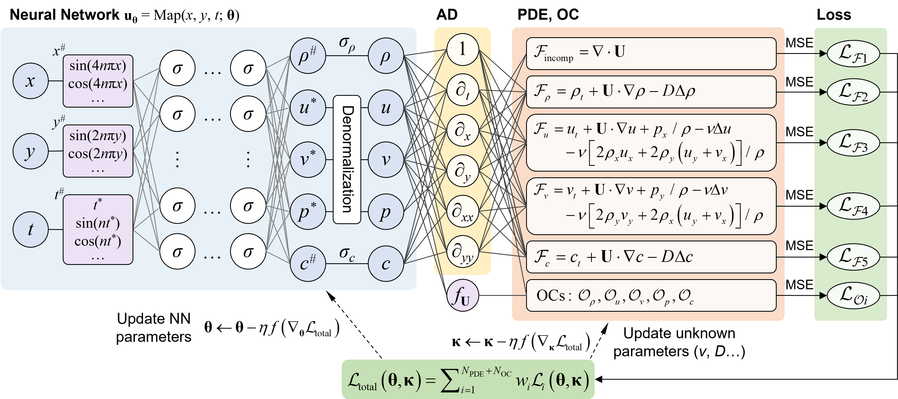
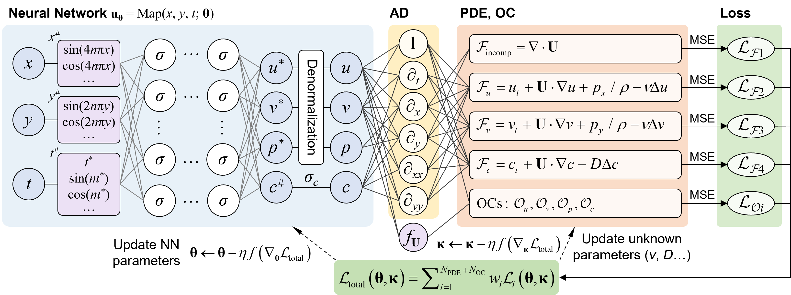

# KH-PINN
Physics-informed neural networks for the inverse problems (field reconstruction and parameter inference) of Kelvin-Helmholtz instability (KHI) flows.

Codes for the paper: [*Physics-informed neural networks for Kelvin-Helmholtz instability with spatiotemporal and magnitude multiscale*](https://doi.org/10.1063/5.0251167).

Preprint version: [*https://arxiv.org/abs/2411.07524*](https://arxiv.org/abs/2411.07524).

Some DNS data can be downloaded from the supplementary materials of the paper.

## Framework

Variable density:

Constant density:

## Typical results

Variable density, *Re* = 10000

Variable density, *Re* = 10000

Constant density, *Re* = 10000

Constant density, *Re* = 10000

